<p align="center">
  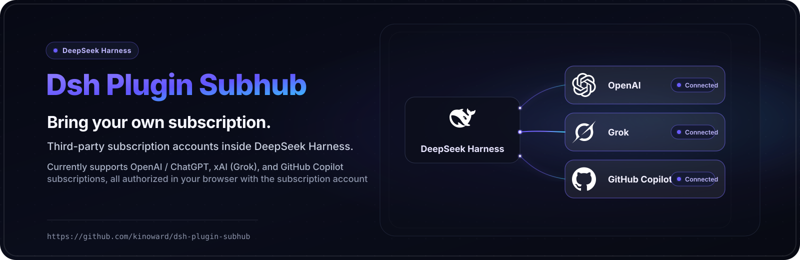
</p>

<h1 align="center">Dsh Plugin Subhub</h1>

<p align="center">
  English · <a href="README.zh.md">中文</a>
</p>

<p align="center">
  <a href="https://awesome-dsh-plugin.com"></a>
  <a href="https://github.com/zp-home/dsh-recommend"></a>
  <a href="https://github.com/kinoward/dsh-plugin-subhub/stargazers"></a>
</p>

<p align="center">
  <a href="https://github.com/kinoward/dsh-plugin-subhub/releases/tag/v1.8.1"></a>
  <a href="LICENSE"></a>
  <a href="package.json">= 22.19" /></a>
  
</p>

Bring a **third-party subscription account** into [DeepSeek Harness](https://github.com/deepseek-ai/deepseek-harness) and chat with the models your subscription covers: text chat, image understanding, image generation, and image editing.

**Supported today: OpenAI / ChatGPT, xAI (Grok), GitHub Copilot, Claude, Gemini, and Kimi Code subscriptions — all signed in with your subscription account through browser authorization. Key-based services are already built into DeepSeek Harness — add them on its Models page.**

> Model availability, usage limits, and response speed are decided by the subscription provider and your account. Some features may become temporarily unavailable after the provider changes its service.

> Gemini subscription calls require a personal Google Cloud OAuth client: create a "Desktop app" client (with the Generative Language API enabled in the same project) and export `GEMINI_OAUTH_CLIENT_ID` and `GEMINI_OAUTH_CLIENT_SECRET` before signing in. Without it the plugin falls back to the public gemini-cli client, whose tokens only authorize Cloud Code-style requests.

## Install

- [DeepSeek Harness](https://github.com/deepseek-ai/deepseek-harness) (`dsh`) with Node.js 22.19 or later.

```sh
dsh plugin --profile web add github:kinoward/dsh-plugin-subhub
dsh web
```

`dsh web` boots the `web` profile (same as `dsh --profile web`). Restart DeepSeek Harness after installing.

## Quick start

1. **Log in** — open **Settings → Third-party subscriptions**, click **Sign in** on the card of the subscription you want (e.g. **OpenAI subscription** for a ChatGPT account or **xAI Grok subscription** for SuperGrok / X Premium+), then open the authorization link in a browser and enter the one-time code (valid for 15 minutes). Once authorized, the page syncs automatically and the subscription appears in the model picker.
2. **Pick a model** — click the model selector at the bottom-left of the input area (it shows the current model and reasoning level), choose **Model**, and pick a model under **OpenAI subscription**. Adjust the reasoning level from the same menu if needed. Available models and reasoning levels come from your account and stay in sync automatically.
3. **Use images** — upload an image and ask about it, describe an image to generate one, or ask to edit an image:

   - View: *“What's in this image?”* / *“Extract the text from this screenshot.”*
   - Generate: *“A cinematic illustration of a neon street on a rainy night.”*
   - Edit: upload an image (or use the one just generated), then *“Change the sky to a sunset, keep everything else the same.”* The edit uses the most recent image in the conversation; upload one first if there is none.

   Viewing, generating, and editing images all require a model that supports image input; the model info marks it with an “Image input” tag.

### Manage your account

- **Re-login / log out** — **Settings → Third-party subscriptions** → **Log in again** switches accounts; **Log out** removes the saved login.
- **Update** — rerun the install command, then restart DeepSeek Harness.
- **Disable** — **Settings → Plugins → Plugin list** → turn off `dsh-plugin-subhub`.

## CLI sign-in (optional)

No graphical interface? Sign in with the bundled script instead. From the profile directory, run:

```sh
node node_modules/dsh-plugin-subhub/login.js
```

The script prints an authorization link and a one-time code — open the link in a browser, enter the code, and the credentials are saved to `~/.dsh-plugin-subhub/openai-auth.json`. After signing in, open **Settings → Third-party subscriptions** once so the subscription appears in the model picker. The bundled script currently covers OpenAI; every other provider signs in on the subscriptions page.

## Screenshots

Browser-framed captures of the plugin in the DeepSeek Harness Web UI — light and dark themes:

**Settings → Third-party subscriptions — signed out:**

<p align="center">
  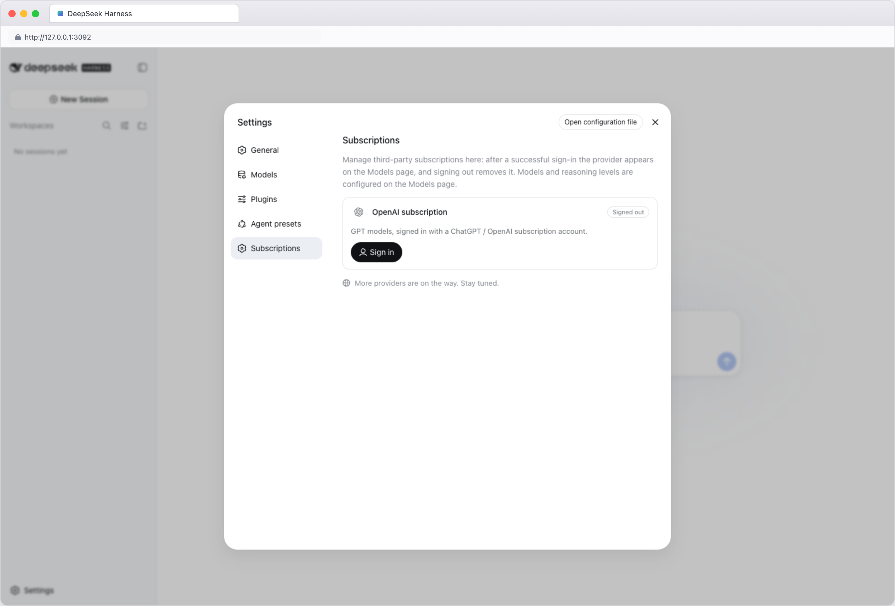
  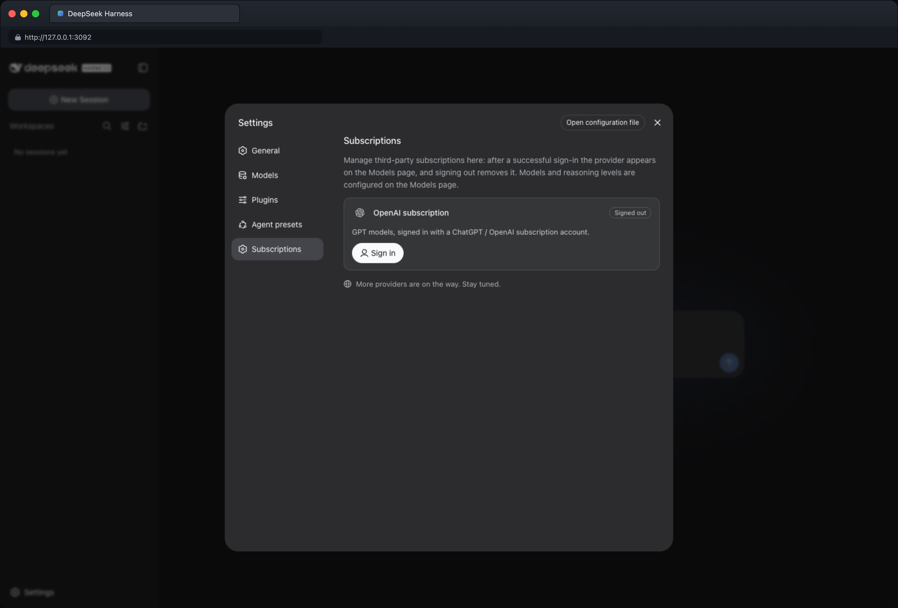
</p>

**Settings → Third-party subscriptions — signed in:**

<p align="center">
  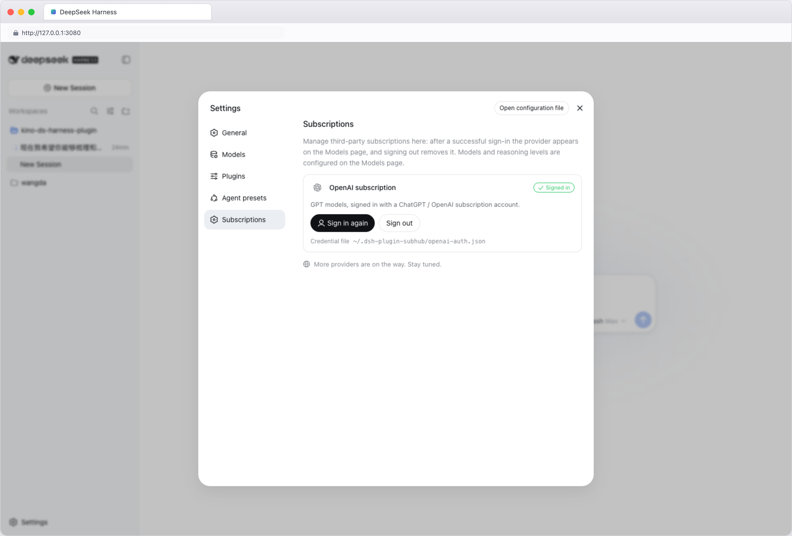
  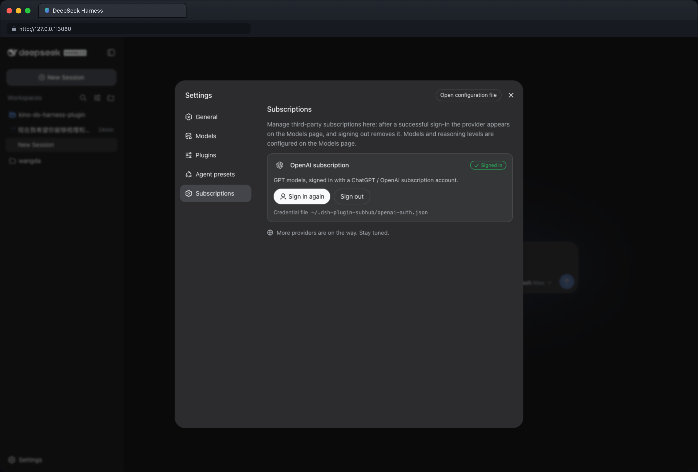
</p>

**Models page — OpenAI subscription expanded (signed in):**

<p align="center">
  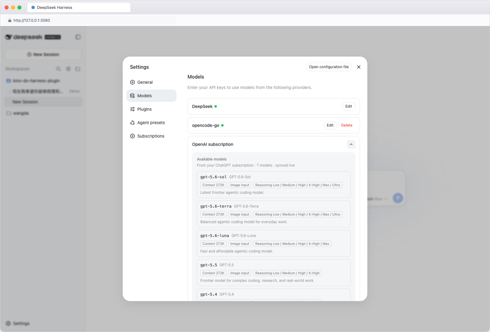
  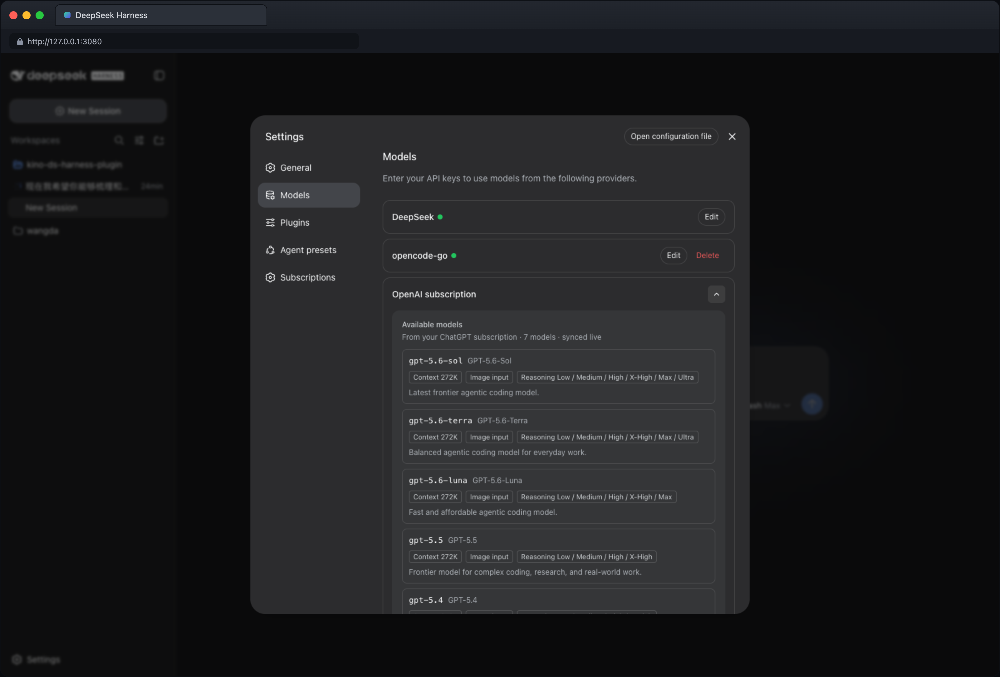
</p>

**Using images in a conversation — image understanding:**

<p align="center">
  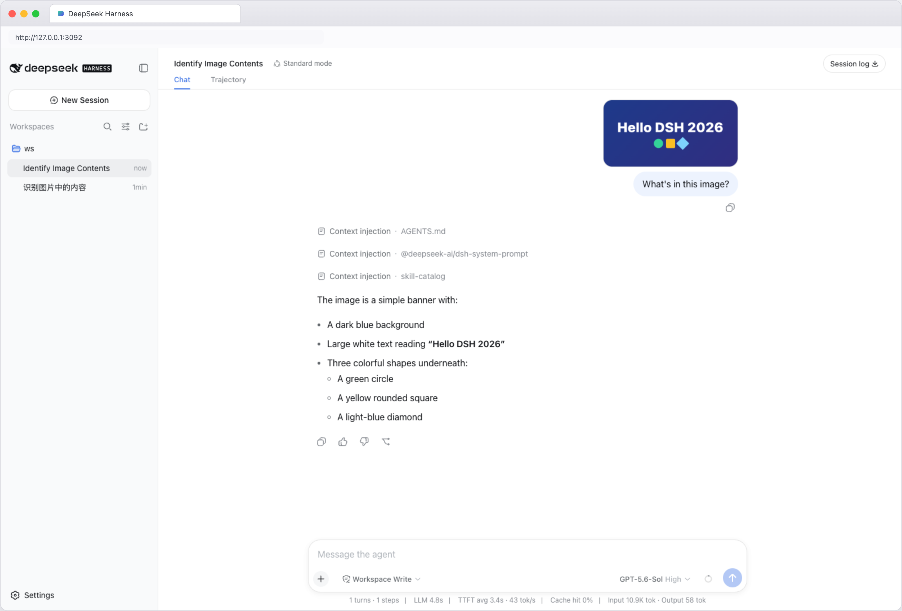
  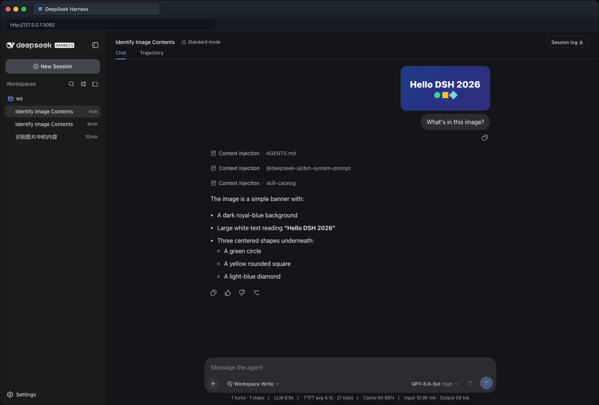
</p>

**Generating images in a conversation — text to image:**

<p align="center">
  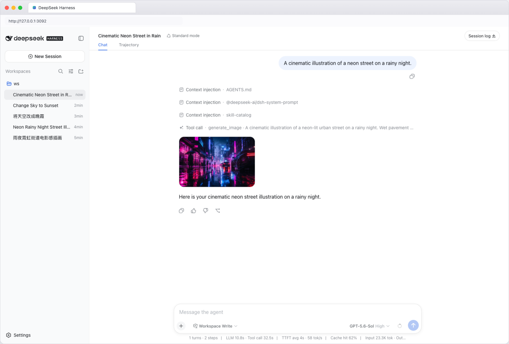
  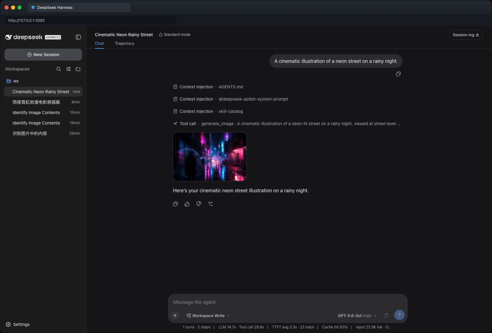
</p>

**Editing images in a conversation — image to image:**

<p align="center">
  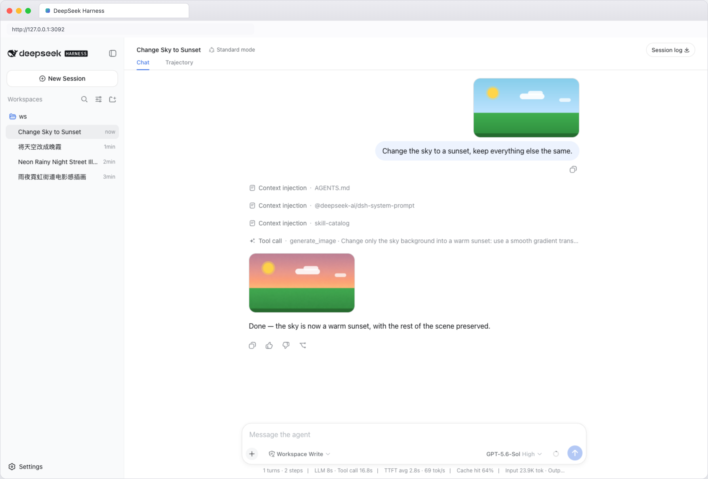
  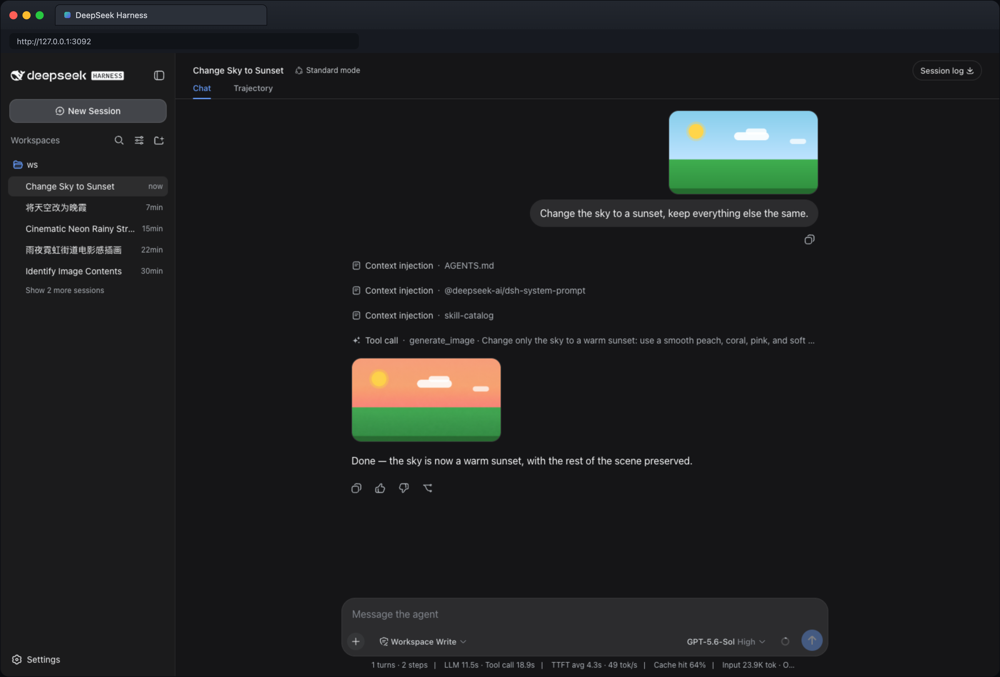
</p>

## Security & privacy

- Unless you configure another location, login data is stored in `~/.dsh-plugin-subhub/<provider>-auth.json` — one file per provider (e.g. `openai-auth.json` for OpenAI, `xai-auth.json` for xAI);
- The plugin creates or updates those files with access restricted to the current system user;
- The plugin never reads login data saved by other programs (such as the Codex CLI); sign in once inside this plugin after installing;
- Signing out deletes the login file the plugin currently uses;
- xAI sign-in reuses the same OAuth flow the official Grok CLI uses; it is a community-supported path, so xAI may change it at any time.
- Don't share login files, one-time codes, or other account details — and don't commit them to Git or post them in issues.

## Support

- [GitHub Issues](https://github.com/kinoward/dsh-plugin-subhub/issues) — report bugs or request features. Remove account details and other sensitive content before posting.

Service names and logos are trademarks of their respective owners.

## License

[MIT](LICENSE)